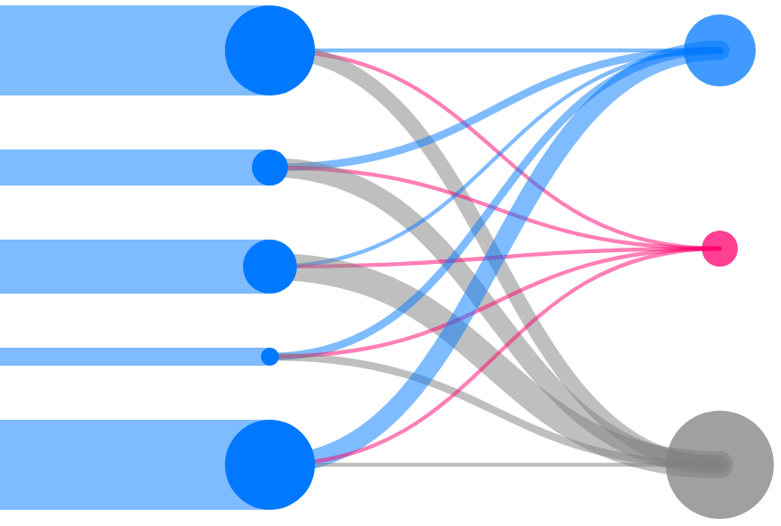

# Anemic Components

Rich-data presentation library written in JavaScript (ES6)

This library is still in its infancy (Pre-alpha).

# What does it do?

With a few lines of code we can generate visuals like this:

Please take a look here from more [examples](./examples/index.html).

# Pull Requests

Lots of work left to be done. Looking forward to pull requests.

# Version

0.0.1 (Pre-alpha)
